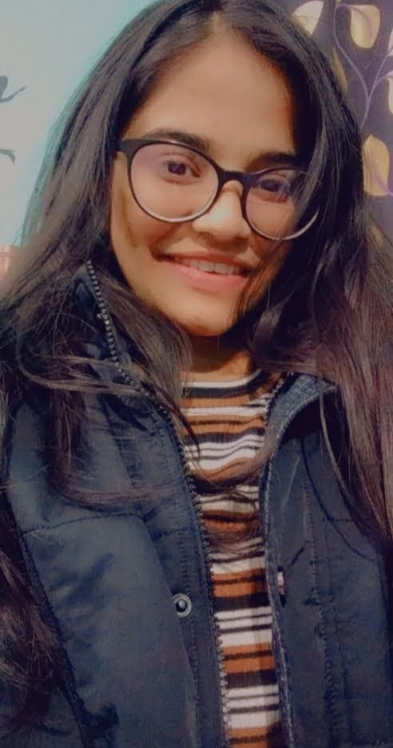
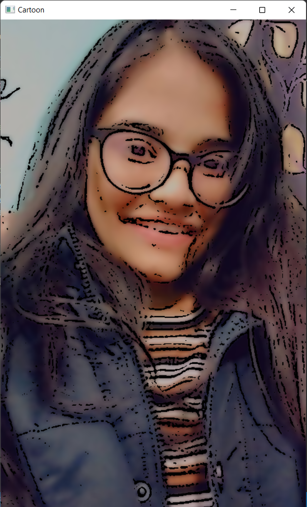

# Cartoon-Filter
## Using OpenCV to Cartoonize an Image
### Steps involved:
* Installing OpenCV
* Importing Required Libraries - cv2 and numpy are the libraries I have used here
* Blurring and cartoonization of the image using various filters available in OpenCV
 

<table>
<tr>
<td>

## Original Image:

</td>
<td>

## Output:

</td>
</tr>
</table>

## Author

- LinkedIn - [Shreeya Kapoor](https://www.linkedin.com/in/shreeya-kapoor-0512/)
- Twitter - [Shreeya Kapoor](https://twitter.com/shreeya_kapoor)
